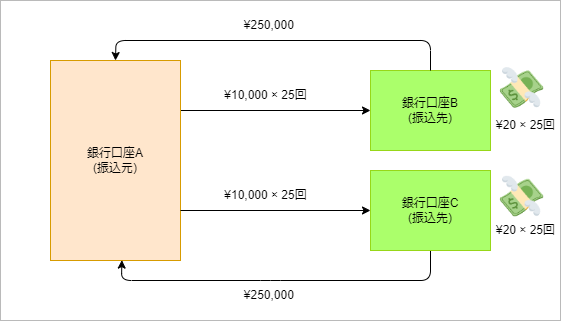
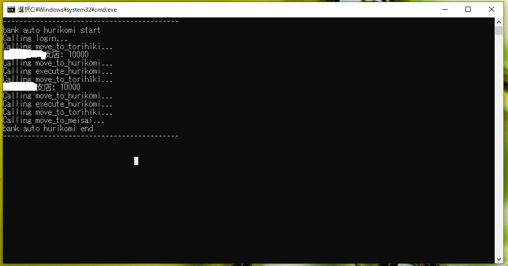

<!--
title:   銀行ポイ活自動化でひと月1,000円稼ぐ方法について①
tags:    Python,Selenium,銀行振込
id:      7e9d011d02bf8d3d98ab
private: true
-->
## はじめに

本記事では、以下の内容について記載します。
* Pythonを使用して銀行口座間の振込によるポイント活動を自動化する方法

## 経緯

被振込によりポイント獲得できるというサービスを、ある銀行が提供しています。(銀行口座名は念のため伏せます。)
条件としては以下の通りです。
* 10,000円以上の振込1回につき20ポイント獲得(ひと月に最大25回)
* 銀行Aから銀行B、Cへの振込手数料は無料
* 銀行B、Cの定額自動振込で行う場合はポイント付与の対象外

    

つまり25回の振込を2口座分行えば、ひと月で1,000円。毎月欠かさずに行えば1年で12,000円の稼ぎとなります。
ただしこれを手動で行うのは非常に手間です。

1. 振込元の銀行口座のアカウントにログイン
2. 取引ページに遷移
3. 振込実行
4. 認証実行
5. 振込結果参照

具体的にはこのような手順を踏むことになりますが、1回の振込で大体3分ぐらいかかる感じです。
それをほぼ毎日やるのは面倒すぎるというわけで、**自動化して楽に1,000円稼ごう**、というのがモチベーションとなっております。


## この記事の対象者

* Pythonを使ってブラウザの自動操作をやってみたい人
* ~~銀行ポイ活を始めたい人~~
* ~~振込を全て手動で頑張っている人~~


## 製造前に確認するべきこと

### 規約上問題ないかどうか確認する

アプリを作成する前に利用規約を熟読し、自動アクセスを行っても問題ないことを確認しておくことをお勧めします。（違法行為にならないように注意しましょう）

### サーバーに与える負荷を軽減する

短時間に大量のアクセスを行うと、Webサーバーに極度の負荷がかかる可能性があります。リクエスト間隔は十分に空けておくことを心がけましょう。
今回採用した方法として、各関数に以下のようなデコレータを仕込み、リクエスト実行前に5~10秒待機させました。

```python
def wait_random_time(func: Callable) -> Callable:
    @wraps(func)
    def wrapper(*args: Any, **kwargs: Any) -> Any:
        wait_time = round(random.uniform(5, 10), 1)
        print(f"Calling {func.__name__}...")
        time.sleep(wait_time)
        return func(*args, **kwargs)
    return wrapper

@wait_random_time
def some_request():
  # 処理実行前に5~10秒待機する
  pass
```

## 環境構築

Windowsに構築することを想定して記載する

### 1. Python3.10をインストール

3.10であることに理由はありません。たまたま自前のPCに入っているのが、このバージョンだったので使用しました。
公式サイトからexeをダウンロードして実行すればよいです。

### 2. 仮想環境構築

コマンドプロンプトを起動し、以下のコマンドを実行します。
`bat
cd [任意のパス]
mkdir [任意のフォルダ名]
cd [任意のフォルダ名]
python -m venv .venv
`

### 3. モジュール追加

仮想環境をアクティベートした状態で、必要なモジュールを追加します。
`bat
.venv\Scripts\activate
pip install selenium==4.22.0
pip install python-dotenv==1.0.1
`

#### Selenium
ブラウザ操作を自動化するために使用します。これから作るアプリでは中心的な役割を持ちます。

#### python-dotenv
Pythonアプリケーション内で環境変数ファイル(.env)を読み込むために使用します。
銀行にログインするときに必要なIDやパスワードをハードコーディングをせずに、環境変数ファイル(.env)に保持することにしました。
（セキュリティ的にどうなのかという疑問は残りますが、とりあえず放置）

## 処理の流れ

### 1. ドライバ作成

ブラウザ操作を行うオブジェクトを生成します。いろいろオプションはあるようですが、今回指定するのは以下のようにします。
* ユーザーエージェントは設定ファイルに記載した配列からランダムに選択
* 余分なログ出力を抑制
* 処理終了後にブラウザを閉じない

```python:src/main.py
from selenium import webdriver
from selenium.webdriver.chrome.service import Service
from selenium.webdriver.chrome.options import Options
from selenium.webdriver.remote.webdriver import WebDriver

def create_driver(config: Dict[str, Any]) -> WebDriver:
    # オプション設定
    options = Options()
    options.add_argument("--user-agent=" + random.choice(config["ua_list"]))
    options.add_experimental_option("excludeSwitches", ["enable-logging"])
    options.add_experimental_option("detach", True)
    # chrome最新バージョンのドライバを返却
    return webdriver.Chrome(service=Service(), options=options)
```

### 2. ログイン

ログイン処理は以下の流れで行います。
1. デコレータを付与してランダム時間を待機
2. 入力要素を検索
   * `WebDriverWait`を使用して要素が現れるまで待機する
   * デベロッパーツールからHTML要素を確認し、探しやすい方法で探せばよい
4. submit用のボタン要素を検索
5. ボタンをクリック

```python:src/bank_transfer_automation.py
from selenium.webdriver.common.by import By
from selenium.webdriver.support.ui import WebDriverWait
from selenium.webdriver.support import expected_conditions as EC

class BankTransferAutomation:
    @wait_random_time
    def login(self, login_url: str, kaiin_no: str, password: str) -> None:
        # ログインページにアクセス
        self.driver.get(login_url)

        # 会員番号
        kaiin_no_element = WebDriverWait(self.driver, self.wait_time).until(
            EC.presence_of_element_located((By.NAME, "kaiinNo"))
        )
        kaiin_no_element.send_keys(kaiin_no)

        # ログインパスワード
        password_element = WebDriverWait(self.driver, self.wait_time).until(
            EC.presence_of_element_located((By.NAME, "ibpassword"))
        )
        password_element.send_keys(password)

        # ログイン実行
        login_button_element = WebDriverWait(self.driver, self.wait_time).until(
            EC.presence_of_element_located(
                (By.XPATH, '//input[@type="button" and contains(@value, "ログイン")]')
            )
        )
        login_button_element.click()
```

### 3. その他処理

振込までに必要な処理はログインと同じ要領で実施できます。つまりは、
1. 操作する要素を適切なキーワードで検索
2. 検索した要素に入力や押下など適切な操作を行う

この手順で以下の作業も同様に行います。
* 取引ページに遷移
* 振込実行
* 認証実行
* 振込結果参照

## 実行

ここまでのフォルダ構成はこんな感じです。
`
$ tree
.
|-- .venv
|-- config.json
|-- requirements.txt
`-- src
    |-- bank_transfer_automation.py
    `-- main.py
`

呼び出し用のメイン処理を作成しておきます。

```python:src/main.py
if __name__ == "__main__":
  # ログイン～振込の処理をだらだらと書く
```

ついでにbatファイルを作成してワンクリックで実行できるようにします。
`bat:exe.bat
call .venv\Scripts\activate
python -m src.main
pause
`

これでbatファイルを叩けば、自動で振り込みが行えるようになりました。実行結果は以下の通りです。



ちなみに通知の仕組みは作成していません。被振込側の銀行のユーザー設定にて、登録したメールアドレスに通知を飛ばすようにしているためです。


## さらなる自動化へ

ここまででもかなりの省力化ができました。が、定期実行できるようになれば毎日クリックする手間すら不要になります。
というわけで作成したPythonスクリプトをAWS上にデプロイして定期実行するようにします。その手順は次の記事にて記載する予定です。